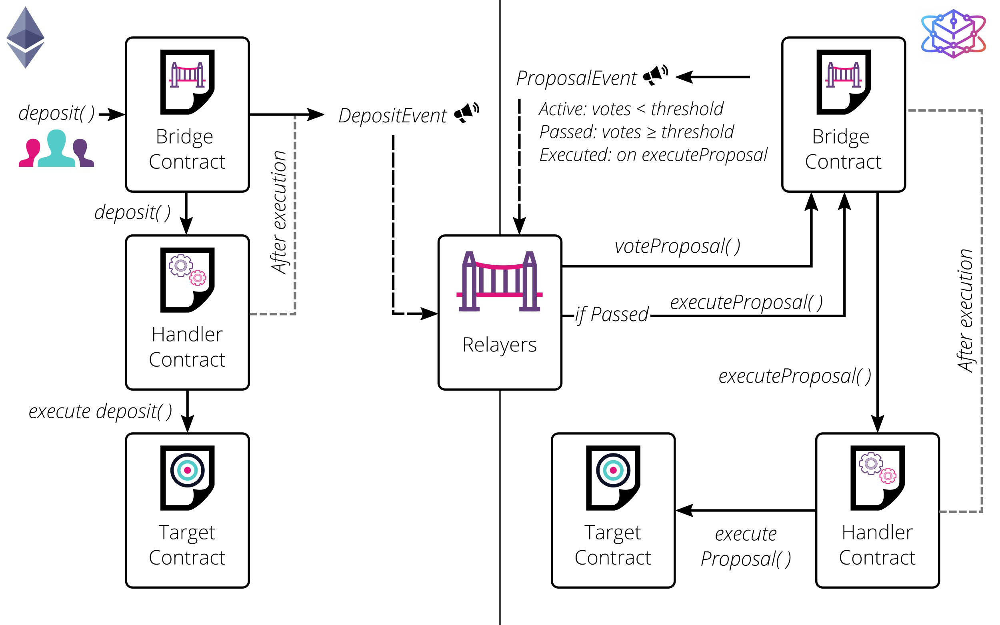

# 跨链桥

## 概述

跨链桥允许两条生态系统独立，且技术实现不同的主链相互通信。跨链桥使用范围可以从可信任的中心化，到去中心化或最小信任。目前推荐的解决方案之一是ChainBridge，一个由ChainSafe构建的模块化多向区块链桥。`Dexchain`现已提供了`ChainBridge`的实现，使得`Dexchain`连接了Ethereum，Heco，BSC等等主链。

## 工作原理

## 申请 Token 跨链

流程如下：

1）提出申请

联系商务或者联系 xxx@dex.io

2）桥部署 Token 合约

3）测试

4）上线