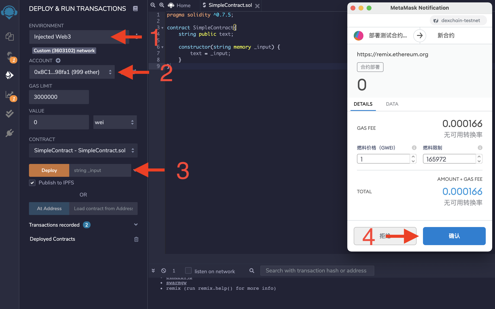
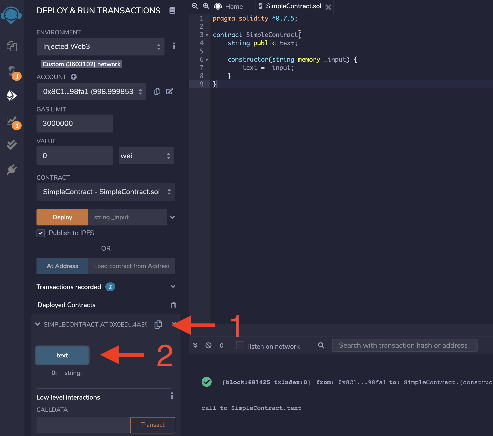

# 智能合约操作

`Dexchain`使用`EVM`作为虚拟机，全面兼容以太坊合约开发。具体开发文档参见[Solidity](https://docs.soliditylang.org/en/latest/)


## 使用Remix部署合约

[Remix](https://remix.ethereum.org)是在线的合约开发和部署工具。首先打开`Remix`页面

## 在Dexchain上部署合约

我们将通过以下基础合约展示如何使用[Remix](https://remix.ethereum.org/)在`Dexchain`上部署智能合约：

```solidity
pragma solidity ^0.7.5;

contract SimpleContract{
    string public text;
    
    constructor(string memory _input) {
        text = _input;
    }
}
```

编译完成后，我们可以来到“Deploy & Run Transactions”标签下。首先需要将环境设置为"Injected Web3."，需要使用MetaMask导入的提供者，通过提供者把合约部署到与其相连的网络上，在本示例中为Dexchain测试网。

我们将使用一个存有资产余额的MetaMask账户来部署合约。可以通过我们的测试网水龙头充值，然后在Dexchain测试网上部署。接下来，在构造函数中输入`Test Contract`，然后点击“部署”。MetaMask弹窗将显示交易相关信息，我们需要点击“确认”进行签名。



交易确认后，合约将出现在Remix的“Deployed Contracts”栏目中。从这里即可与合约功能进行交互。

