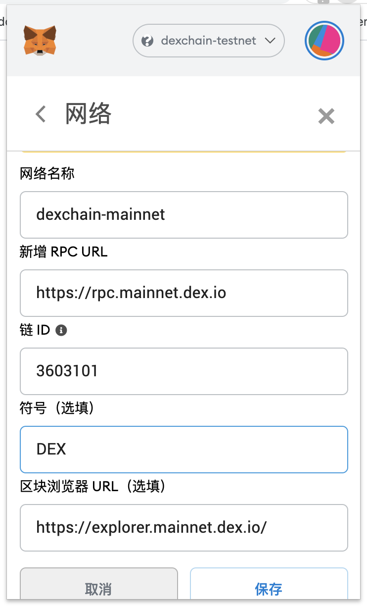

# 概况

支持 metamask 浏览器插件

> 注意：提现到钱包之前，请检查兼容性，已知 Ledger 暂未支持

# metamask

下载地址：https://metamask.io/

添加自定义网络：

## 主网

```
chainid: 3603101
rpc: https://rpc.mainnet.dex.io
scan: https://explorer.mainnet.dex.io/
```



## 测试网

```
chainid: 3603102
rpc: https://rpc.testnet.dex.io
scan: https://explorer.testnet.dex.io/
```
